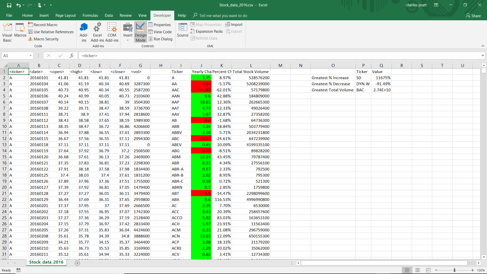

### Stock Market Analyst

Created a script that loops through each year of stock data and grabs the total amount of volume each stock had over the year.
It also displays the ticker symbol to coincide with the total volume.

Result:

